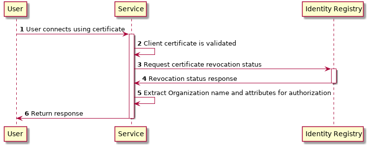
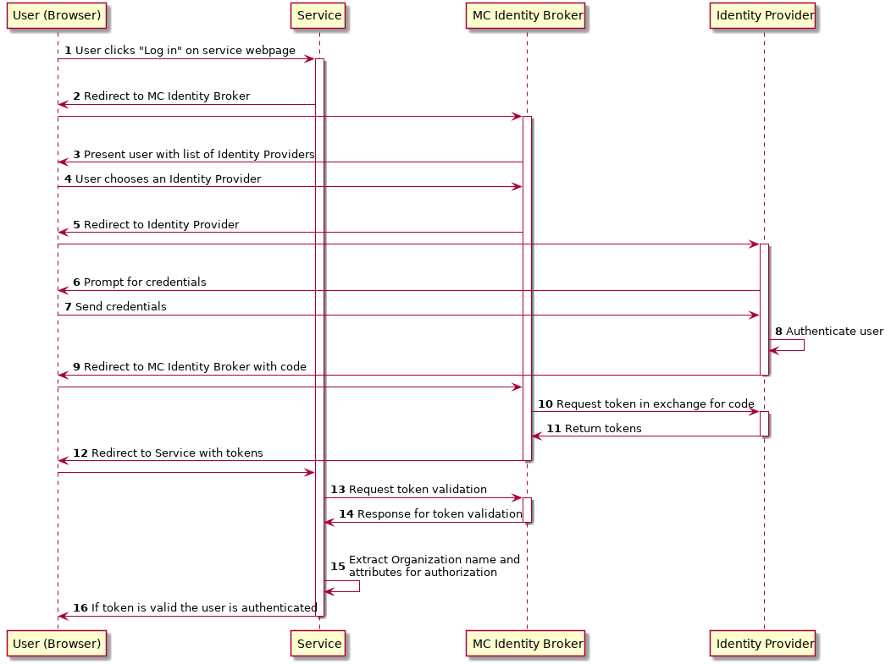
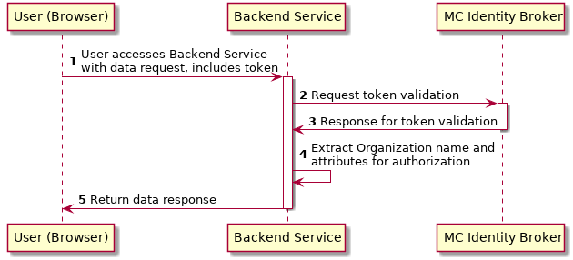

.. _mir:

Maritime Identity Registry (MIR)
================================
Maritime Identity Registry (MIR for short) is an identity provider and an authority for identities of persons, organizations or ships that are using the MCP.
Technically MIR consists of a PKI library and a RESTful API for managing identities and certificates which are standardized by MCC.
Under the API MIR can authenticate an user, based on two methods:

* Public Key Infrastructure (PKI): :ref:`PKI description link<mcp-pki>`.
* Open ID Connect (OIDC): :ref:`OIDC description link<mcp-oidc>`.

MIR API accepts either a certificate (PKI) or a token (OIDC) for user authentication.
After the authentication and following authorization, the user can register and manage the entities through the MIR API, with a proper right what we defined as a role.
One important feature on the management is to issue or revoke a X509 client certificate for entities that are already registered in the API database.

Identity Management
^^^^^^^^^^^^^^^^^^^
Identity management refers to the process of employing technologies to manage information about the identity of users and control access to company resources. The goal of identity management is to improve productivity and security while lowering costs associated with managing users and their identities, attributes, and credentials.

The goal of MIR is to create a solution that satisfies the most common identification needs for the entire maritime industry on a global scale, as it is shown in the :ref:`MCP namespace <mcp-mrn>`.

This is not a simple task as any solution must support every possible user scenarios from small leisure sailors to multinational companies. The complexity of this task is why the functionality will be delivered over multiple milestones in the coming years. The most important things such as support for authentication will be implemented first. Additional functionality will be added based on user needs in the projects supported by MCP.

.. _mir-authentication:

Authentication in MIR
^^^^^^^^^^^^^^^^^^^^^
MIR authenticates an user or a vessel based on two authentication methods, Public Key Infrastructure (PKI) and Open ID Connect (OIDC). Please refer the detail in :ref:`MIR description <mir>`.

Certificate (PKI) Authentication Flow
~~~~~~~~~~~~~~~~~~~~~~~~~~~~~~~~~~~~~~~~~~~~~~~~~~~
To illustrate the authentication flow using a certificate the sequence diagram below is provided.

Alternatively it is possible to get a token from certificate. See more detail in :ref:`Obtaining an OIDC Token using a Certificate section<cert-to-token>`.

OIDC Authentication Flow
~~~~~~~~~~~~~~~~~~~~~~~~~~~~~~~~~~~~~~~~~~~~~~~~~~~
To illustrate the authentication flows the sequence diagrams below is provided.

The first diagram below shows the standard `OpenID Connect Authorization Code Flow <http://openid.net/specs/openid-connect-core-1_0.html#CodeFlowAuth>`__ involving a browser being used by the user to access a service in the form of a webpage.

The second diagram shows the flow used when an authenticated user is accessing a backend service. For browser based services this scenario is often used when the browser retrieves data from backend services. In this scenario since the user is authenticated, the user has a token that is presented for authentication for the backend service.

.. _mir-authorization:

Authorization in MIR
^^^^^^^^^^^^^^^^^^^^

As an example of how authorization can be done, let us have a look at how it is handled inside the MCP Identity Registry. When it comes to authorization, the Identity Registry will have the same information about its users as any other service in MCP.

The Identity Registry currently has these roles:

+--------------------+-----------------+--------------+--------------------+----------------------+-----------------------+----------------------+--------------------+--------------------+------------+
| Role               | Approve New Org | Edit Own Org | Maintain Org Users | Maintain Org Vessels | Maintain Org Services | Maintain Org Devices | Maintain Org MMSes | Maintain Org Roles | Delete Org |
+--------------------+-----------------+--------------+--------------------+----------------------+-----------------------+----------------------+--------------------+--------------------+------------+
| ROLE_SITE_ADMIN    |        X        |       X      |          X         |           X          |           X           |           X          |          X         |          X         |      X     |
+--------------------+-----------------+--------------+--------------------+----------------------+-----------------------+----------------------+--------------------+--------------------+------------+
| ROLE_ORG_ADMIN     |                 |       X      |          X         |           X          |           X           |           X          |          X         |          X         |            |
+--------------------+-----------------+--------------+--------------------+----------------------+-----------------------+----------------------+--------------------+--------------------+------------+
| ROLE_ENTITY_ADMIN  |                 |              |          X         |           X          |           X           |           X          |          X         |                    |            |
+--------------------+-----------------+--------------+--------------------+----------------------+-----------------------+----------------------+--------------------+--------------------+------------+
| ROLE_USER_ADMIN    |                 |              |          X         |                      |                       |                      |                    |                    |            |
+--------------------+-----------------+--------------+--------------------+----------------------+-----------------------+----------------------+--------------------+--------------------+------------+
| ROLE_VESSEL_ADMIN  |                 |              |                    |           X          |                       |                      |                    |                    |            |
+--------------------+-----------------+--------------+--------------------+----------------------+-----------------------+----------------------+--------------------+--------------------+------------+
| ROLE_SERVICE_ADMIN |                 |              |                    |                      |           X           |                      |                    |                    |            |
+--------------------+-----------------+--------------+--------------------+----------------------+-----------------------+----------------------+--------------------+--------------------+------------+
| ROLE_DEVICE_ADMIN  |                 |              |                    |                      |                       |           X          |                    |                    |            |
+--------------------+-----------------+--------------+--------------------+----------------------+-----------------------+----------------------+--------------------+--------------------+------------+
| ROLE_MMS_ADMIN     |                 |              |                    |                      |                       |                      |          X         |                    |            |
+--------------------+-----------------+--------------+--------------------+----------------------+-----------------------+----------------------+--------------------+--------------------+------------+
| ROLE_APPROVE_ORG   |        X        |              |                    |                      |                       |                      |                    |                    |            |
+--------------------+-----------------+--------------+--------------------+----------------------+-----------------------+----------------------+--------------------+--------------------+------------+
| ROLE_USER          |                 |              |                    |                      |                       |                      |                    |                    |            |
+--------------------+-----------------+--------------+--------------------+----------------------+-----------------------+----------------------+--------------------+--------------------+------------+

A few things should be noted:

* "Maintain" (as mentioned in the table above) means to be able to create, update and delete, as well as issuing and revoking certificates.

* Excluding entities with the role ROLE_SITE_ADMIN, it is not possible for entities to see entities from other organizations.

* A ROLE_SITE_ADMIN can maintain entities and organizations beyond his own organization.

* Any entity, regardless of roles, can see all entities from its own organization, though some sensitive information from services is filtered for non-admins.

* Only a ROLE_SITE_ADMIN can assign ROLE_SITE_ADMIN and ROLE_APPROVE_ORG roles.

* A ROLE_APPROVE_ORG can create a user for an organization if and only if there is no users for the organization (this is used for creating the first administrative user for an organization).

In this example we will focus on **ROLE_USER** and **ROLE_ORG_ADMIN**. Let us assume that an Organization (DMA) wants to grant members of the internal "E-navigation" department administrative rights in the MCP Identity Registry. In DMAs Identity Provider setup the department name is automatically added to the "permissions" attribute. So to make this mapping the current DMA administrator sets up a role mapping between the permission "E-navigation" and the role ROLE_ORG_ADMIN. Once this is done, all members of the DMA E-navigation department will have administrative rights for the DMA organization inside the Identity Registry. As noted earlier, these rights only apply inside the Identity Registry. Other services must create a similar setup with mapping of roles and permissions.

Brokered User Federation
^^^^^^^^^^^^^^^^^^^^^^^^
In most federated setups it starts from the website (Service Provider) that need authentication and the identity provider, normally presented with a "Log in with X" link, where X could be Facebook, Google, etc. MCP has 2 steps for it, where the first step is MCP Identity Broker which presents the user with a list of available identity providers, which is the second step.
For a deeper understanding of how this is actually done please read the `Identity Broker overview section from the Keycloak manual <https://www.keycloak.org/docs/latest/server_admin/index.html#_identity_broker_overview>`__.

MCP supports the brokered user federation as long as non-MCP identity providers follow OAuth 2.0 by means of the federation of identity providers.
The federation is the means of linking distinct identity management systems to a person’s electronic identity and attributes. For example, a shipping company might expose all their users in LDAP or Active Directory to MCP in such a way as they appear as MCP users. Thereby bypassing the need to manage their users directly in MCP. This also means that MCP is not responsible for management of users.
In practical terms, federation means that users asked to authenticate in MCP will be redirected to a login webpage supplied by their organization where they can login using their organizational id.
Since the authentication process is the responsibility of the organizations, it is also up to the individual organizations to choose an appropriate authentication method. While most will likely use classic username/password authentication, multi factor security, biometric security or other approaches could be used.

What MCC governs in MIR
^^^^^^^^^^^^^^^^^^^^^^^
* :ref:`MCP namespace <mcp-mrn>`
* :ref:`MCP types and its hierarchy <mcp-type>`
* :ref:`PKI certificate profile <mcp-pki-cert-profile>`
* :ref:`OIDC Token <mcp-token>`
* REST API (https://test-api.maritimecloud.net/v2/api-docs)
* MCP Instance Provider root CA list
* MIR reference implementation

MIR reference implementation
^^^^^^^^^^^^^^^^^^^^^^^^^^^^^^^^^^
MCC governs the reference implementations on MIR as follows:

* MCP-PKI library for handling certificates: https://github.com/MaritimeConnectivityPlatform/MCP-PKI
* MIR API: https://github.com/MaritimeConnectivityPlatform/IdentityRegistry
* MIR Identity Broker: https://github.com/MaritimeConnectivityPlatform/MCPKeycloakSpi

MIR Identity Broker which enables the token-based user authentication is based on `Keycloak <https://www.keycloak.org/>`__ which is an OpenID Connect (OIDC) server developed by Red Hat, but including two MCP specific plugins for synchronization of user data with MIR API and converting MCP client certificates to OIDC tokens.
Giving a detailed account of the synchronization part when the API is called to create a new user with corresponding information it is registered in the API database and also the ID Broker accounts.
The synchronization is provoked when a user logs in using an external identity provider by registering the user’s information to the API database.
In our testbed we use the federation to enable the participants across different projects to register and utilize MCP services established by the projects, as well as validate the identity management concept of MCP.
