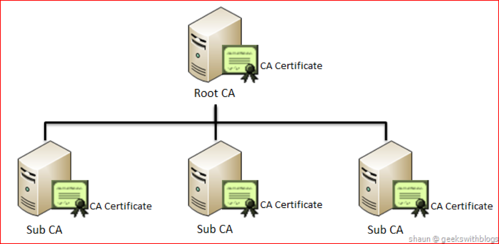

.. _mcp-pki:

Public Key Infrastructure (PKI)
===============================
A Public Key Infrastructure (PKI) is a set of hardware, software, people, policies, and procedures needed to create, manage, distribute, use, store, and revoke digital authentication certificates and manage public-key encryption. Thereby helping an organization establish and maintain a trustworthy networking environment. There is no inherent requirement for using a PKI based solution for enabling secure machine to machine (M2M) communication, but it is the most commonly used solution and lots of software, standards and best practices exists for utilizing it. The choice of using PKI based on the X.509 standard for M2M communication in MCP was thus straightforward.

The key piece in a PKI architecture is a PKI CA (Certificate Authority) which is an entity that issues digital authentication certificates. A digital certificate that certifies the ownership of a public key by the named subject of the certificate. An obvious example would be creating a certificate for a vessel, which can serve to certify that a given document was indeed signed by someone in possession of the certificate issued to that vessel.

One of the most important aspects of designing a PKI based architecture is the certificate hierarchy planning because the design will affect how certificates are validated and used by PKI-enabled actors. Normally a PKI based architecture is arranged in a tree like hierarchy with a single root entity in the top and with numerous leaves called sub CAs. Each sub CA can have their own sub CA thereby forming a tree with a single entity at the top. Each leave in the tree is responsible for creating certificates, for example, ships or organizations. The reason for doing this is to be able to delegate the responsibility to different parties. For example, in the case of MCP one could envision that at some point in the future every flag state would be their own sub CA. Having the sole responsibility of issuing certificates for vessels registered under their own flag.

In the current version of MCP we are working with four sub CAs that have the responsibility for issuing all certificates. The four sub CAs are IALA, BIMCO, SMART Navigation Project and the MCP Identity Registry itself.

The most important functionality of a CA is issuing digital certificates. A digital certificate certifies the ownership of a public key by the named subject of the certificate. This allows others (relying parties) to rely upon signatures or on assertions made about the private key that corresponds to the certified public key. In this model of trust relationships, a CA is a trusted third party—trusted both by the subject (owner) of the certificate and by the party relying upon the certificate. In the case of MCP these certificates are typically used to make secure connections between maritime actors over the Internet. A certificate is required in order to avoid the case that a malicious party which happens to be on the path to the target server pretends to be the actual target. Such a scenario is commonly referred to as a man-in-the-middle attack. The client uses the CA certificate to verify the CA signature on the server certificate, as part of the checks before establishing a secure connection. Likewise, the server has the option of inspecting the clients certificate before allowing it to connect.

To issue a new certificate for, for example, a vessel an administrator for the organization who owns the ship will need to log in to MCP Portal and use its functionality for issuing new certificates. The certificate being issued will contain information about the name of the ship, the owner, the flag state and other attributes such as MMSI and IMO number. In the current implementation there is no validation of this information other than that the organization must have been accepted when signing up. We do not expect this to be a problem for the foreseeable future as the number of participating parties is still relatively small. In the future where many more organizations have been added it might, for example, be possible to integrate with national registries so an automated checks of these information can be made.

After having issued a certificate the administrator can now install it on the ship in some way. The actual logistics about how and where to install it is outside of the scope of the identity registry as this might vary a lot between organizations and projects. This also reduces the functionality of the identity registry to just provide the core functionality of Identity management allowing users to be able to build innovative solutions on top of it. This also applies directly to machine to machine communication. The identity registry places no restrictions about what kind of machine to machine communication protocols that should be used, it just provides the basic infrastructure to allow for each machine to authenticate the host in the other end. Letting each project select their protocols if needed.

.. _mcp-pki-cert-profile:

MCP Certificate
---------------
MCP can issue X.509 certificates for the users which can then be used for authentication. Service providers relying on X.509 certificate authentication must obtain and install MCP root certificate into their webservice.

Please note that the use of *MCP MRN* and *MRN* is based on :ref:`MCP namespace <mcp-mrn>` excluding *Subsidiary MRN*.

The standard information present in an X.509 certificate includes:

* **Version** – which X.509 version applies to the certificate (which indicates what data the certificate must include)

* **Serial number** – A unique assigned serial number that distinguishes it from other certificates

* **Algorithm information** – the algorithm used to sign the certificate

* **Issuer distinguished name** – the name of the entity issuing the certificate (MCP)

* **Validity period of the certificate** – the number of months that the certificate is valid

* **Subject distinguished name** – the name of the identity the certificate is issued to

* **Subject public key information** – the public key associated with the identity

The Subject distinguished name field will consists of the following items:

+------------------------+----------+-----------+-----------+-------------------+--------+--------------------+
| Field                  | User     | Vessel    | Device    | Service           | MMS    | Organization       |
+========================+==========+===========+===========+===================+========+====================+
|CN (CommonName)         |Full name |Vessel name|Device name|Service Domain Name|MMS name|Organization Name   |
+------------------------+----------+-----------+-----------+-------------------+--------+--------------------+
|O (Organization)        |                            Organization MCP MRN                                    |
+------------------------+----------+-----------+-----------+-------------------+--------+--------------------+
|OU (Organizational Unit)|"user"    |"vessel"   |"device"   |"service"          |"mms"   |"organization"      |
+------------------------+----------+-----------+-----------+-------------------+--------+--------------------+
|E (Email)               |User email|                                                    |Organization email  |
+------------------------+----------+-----------+-----------+-------------------+--------+--------------------+
|C (Country)             |                             Organization country code                              |
+------------------------+----------+-----------+-----------+-------------------+--------+--------------------+
|UID                     |                          Entity MCP MRN                       |Organization MCP MRN|
+------------------------+----------+-----------+-----------+-------------------+--------+--------------------+

An example of the fields for a vessel could look like this::

  C=DK, O=urn:mrn:mcp:org:idp1:dma, OU=vessel, CN=JENS SØRENSEN, UID=urn:mrn:mcp:vessel:idp1:dma:jens-soerensen

Finally, In additions to the information stored in the standard X.509 attributes listed above, the X509v3 extension SubjectAlternativeName (SAN) extension is used to store extra information. There already exists some predefined fields for the SAN extension, but they do not match the need we have for maritime related fields. Therefore the “otherName” field is used, which allows for using a Object Identifier (OID) to define custom fields. The OIDs currently used are not registered at ITU, but are randomly generated using a tool provided by ITU (see http://www.itu.int/en/ITU-T/asn1/Pages/UUID/uuids.aspx). See the table below for the fields defined, the OIDs of the fields and which kind of entities that uses the fields.

+-----------------+------------------------------------------------+---------------------------------------+
| Name            | Object Identifier (OID)                        | Used by                               |
+=================+================================================+=======================================+
| Flagstate       |`2.25.323100633285601570573910217875371967771`  | Vessel, Service                       |
+-----------------+------------------------------------------------+---------------------------------------+
| Callsign        |`2.25.208070283325144527098121348946972755227`  | Vessel, Service                       |
+-----------------+------------------------------------------------+---------------------------------------+
| IMO number      |`2.25.291283622413876360871493815653100799259`  | Vessel, Service                       |
+-----------------+------------------------------------------------+---------------------------------------+
| MMSI number     |`2.25.328433707816814908768060331477217690907`  | Vessel, Service                       |
+-----------------+------------------------------------------------+---------------------------------------+
| AIS shiptype    |`2.25.107857171638679641902842130101018412315`  | Vessel, Service                       |
+-----------------+------------------------------------------------+---------------------------------------+
| Port of register|`2.25.285632790821948647314354670918887798603`  | Vessel, Service                       |
+-----------------+------------------------------------------------+---------------------------------------+
| Ship MRN        |`2.25.268095117363717005222833833642941669792`  | Service                               |
+-----------------+------------------------------------------------+---------------------------------------+
| MRN             |`2.25.271477598449775373676560215839310464283`  | Vessel, User, Device, Service, MMS    |
+-----------------+------------------------------------------------+---------------------------------------+
| Permissions     |`2.25.174437629172304915481663724171734402331`  | Vessel, User, Device, Service, MMS    |
+-----------------+------------------------------------------------+---------------------------------------+
| Subsidiary MRN  |`2.25.133833610339604538603087183843785923701`  | Vessel, User, Device, Service, MMS    |
+-----------------+------------------------------------------------+---------------------------------------+
| Home MMS URL    |`2.25.171344478791913547554566856023141401757`  | Vessel, User, Device, Service, MMS    |
+-----------------+------------------------------------------------+---------------------------------------+
| URL             |`2.25.245076023612240385163414144226581328607`  | MMS                                   |
+-----------------+------------------------------------------------+---------------------------------------+

Encoding of string values in certificates must follow the specifications defined in RFC 5280, and where possible it is highly recommended to use UTF-8.

Revocation of MCP certificate
------------------------------
A crucial part of any PKI is to support revocation of certificates, so that certificates that belongs to entities who is no longer trusted, affiliation has change, etc., can be mark as not trusted any more. Anyone who wishes to validate a certificate can then check if the certificate has been marked as revoked. The checking of the certificate revocation status can be done in two ways:

1. Call the OCSP interface provided by the Identity Registry for each certificate.
2. Periodically download a Certificate Revocation File from the Identity Registry and use it check certificates locally.

The endpoints for both the OCSP interface and the Certificate Revocation File are embedded into the certificates issued by MCP Identity Registry, and are currently https://api.maritimecloud.net/x509/api/certificates/crl and https://api.maritimecloud.net/x509/api/certificates/ocsp.
