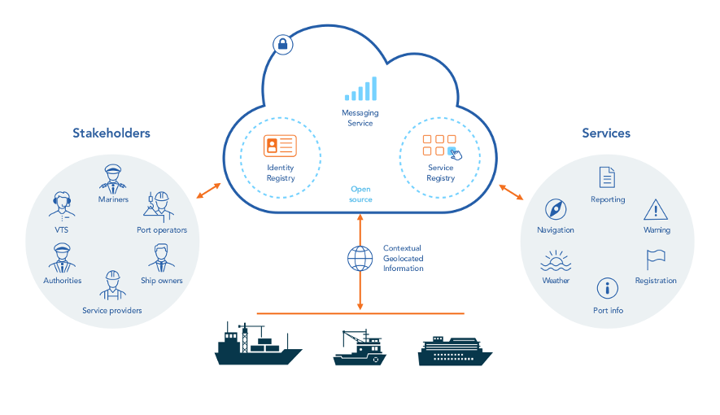

.. _mcp-basic-concept:

Basic Concept
===============

**Maritime Connectivity Platform (MCP)** is a service-oriented architecture that is composed of three core components:

  * **Maritime Identity Registry (MIR)**: MIR has the objective to enable an authentication of all maritime stakeholders in the context of the Maritime Connectivity Platform and thus increasing the security and reliability of communication. This goal is archived by providing a trustworthy infrastructure for identity authentication of maritime entities like human actors, services and devices.
  * **Maritime Service Registry (MSR)**: MSR is supposed to serve as a central reference point to provide and find services and thus to improve the visibility and accessibility of available information and services in the maritime domain. It’s best compared with a yellow pages phone book.
  * **Maritime Messaging Service (MMS)**: MMS offers secure and efficient communication for the maritime domain. MMS is a message broker platform that delivers message to destination through both IP and non-IP communication channel by utilizing Maritime Resource Name (MRN) as endpoint address.

A simple example
-------------------------------------------
<Will be given>

Functionalities of MCP
------------------------
Identity Management
^^^^^^^^^^^^^^^^^^^^^^^^^^
The MIR enables that each maritime entity (such as a device, human, organization, service, or ship) can be registered as a participant of the MCP and be equipped with a unique identity. The identity is given in terms of a `MRN (Maritime Resource Name) <https://www.iana.org/assignments/urn-formal/mrn>`__. While MIR governance harmonizes the :ref:`MCP MRN namespace <mcp-mrn>` governed by the MCC and sets out criteria for the registration process it is up to the MIR instances to implement and have certified concrete identity registries.

.. _mcp-authentication:

Authentication
^^^^^^^^^^^^^^^^^^^^^^^^^^
Authentication is any process by which a system verifies the identity of a user (human or machine) who wishes to access it. Since access control is normally based on the identity of the user who requests access to a resource, authentication is essential to efficient security. In contrast to identification which refers to the act of stating a person or thing’s identity, authentication is the process of actually confirming the stated identity. It might involve verifying the authenticity of a website by a digital certificate that it provides, or validating a persons identity documents.

The way in which a human user or machine may be authenticated typically falls into three different categories, based on what is commonly known as the factors of authentication: something the user knows, something the user has, and something the user is. Each authentication factor covers a range of elements used to authenticate or verify a person’s identity prior to being granted access, approving a transaction request, signing a document or other work product, granting authority to others, and establishing a chain of authority.

* Knowledge factors: passwords, passphrases, pins, challenge response,

* Ownership factors: ID card, cell phone, authentication certificates,

* Inheritance factors: fingerprint, retinal patterns, face, voice,

Currently the implementation effort in MCP is concentrating on passwords for human users and authentication certificates for machine users. In the future we will probably add more methods.

While the difference of using authentication certificates or passwords might seem minor from a user perspective the underlying implementation and usage is radically different which is why it has been split into different sections.

If you want to get more information on how the MCP authenticates identities through the MIR, please refer the :ref:`Authentication in MIR <mcp-authentication>` section.

Authorization
^^^^^^^^^^^^^^^^^^^^^^^^^^
Another central aspect of Identity Management is the concept of authorization which is the process of determining a set of permissions that is granted to a specific trusted identity. In all practical senses, authorization follows authentication. Once a system knows who you are, the system can determine what is appropriate for you to be able to see or do. authorization can be determined based on the user identity alone, but in most cases requires additional attributes about the user, such as role, title, flag state, etc.

Authorization can typically be handled in two ways.

* Locally by the application or service that is being accessed.
* Centralizing the authorization policy decisions regardless of the location of the user or the application/service

Since authorization can always be done locally by the application that is being accessed, for example by storing user rights in a local database, we have decided that MCP will not prioritize central support for authorization for the next milestones. Instead focusing on getting authentication right.

Before implementation of centralized support for authorization can begin there are some obstacles that lie ahead. Mainly because there, unlike authentication, are no good standards for doing authorization.

Even though there are no real standards there are a number of approaches that are commonly used. The most commonly used probably being role-based access control (RBAC). RBAC is an access control mechanism defined around roles and privileges. The components of RBAC such as role-permissions, user-role and role-role relationships make it simple to do user assignments of entitlements. However, adopting RBAC for MCP opens some questions. For example, who defines the roles and are they global roles. Or are they local to a particular service or a particular organization. For example, an "administrator" role might entail a list of certain privileges in one organization and another list of privileges in another organization.

Given these issues and many other we have to decide not to implement central authorization in MCP. Instead MCP will provide the information that can be used for authorization in the services.

As described in the sections about :ref:`Authentication in MIR <mir-authentication>`, both authentication methods provides information about the authenticated user that can be used for authorization:

* The organization the entity belong to.

* The permissions/roles/groups the entity has been assigned by the organization.

When an organization wishes to use a service, the organization will then make an agreement with that about how access levels shall be defined in that service, based on the permissions. This will have to be done for each service the organization wishes to use.

If you want to get more information on how the MCP achieve the authorization through the MIR, please refer the :ref:`Authorization in MIR <mir-authorization>` section.
